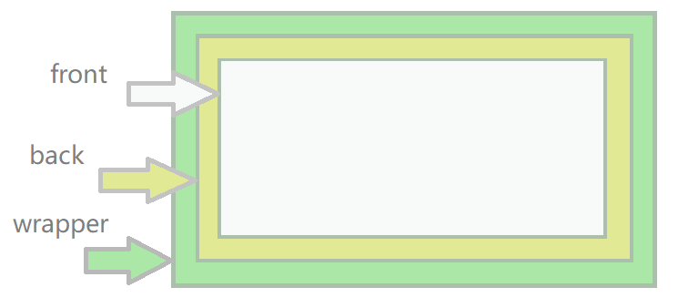

# vue-better-slider

> 一个 Vue 的滑动按钮组件，有关滑动方面的处理借鉴 better-scroll 的实现。

[在线例子](https://symind.github.io/vue-better-slider/index.html)

# 起步
## 安装
``` bash
npm i --save vue-sliding-button
```

## 引入
``` js
import Vue from 'vue'
import SlidingButton from 'vue-sliding-button'

Vue.use(SlidingButton)
```
## 使用
``` html
<template>
    <div>
      <better-slider>
        <div slot="front" class="front">
          前面的内容
        </div>
        <div slot="back" class="back">
          后面的内容
        </div>
      </better-slider>
    </div>
</template>
<script>

</script>
```

# 原理
## 布局


绿色部分为 wrapper，它拥有两个子元素为 back 和 front，它的高度会被 front 撑起。黄色部分为 back，它使用**绝对定位**，它的高度与 wrapper 相同，值得注意的是为了提高性能，back 在用户触摸该控件是才被插入。front 与 back 同级。
## 关闭
组件提供关闭动画，调用组件的 close 方法使用，可以通过监听 clickBackEvent 等事件，通过传入的组件引用已调用该方法。需要注意的是，该方法并不会删除该组件，可以通过监听 closeTransitionEndEvent 事件，在其中进行自己的处理。
# 选项
SlidingButton 支持很多属性。
## right
* 类型：Number
* 默认值：80
* 作用：从左向右滑动时，右边展示宽度
## left
* 类型：Number
* 默认值：80
* 作用：从右向左滑动时，左边展示宽度
## rightBackgroundColor
* 类型：Number
* 默认值：80
* 作用：从左向右滑动时，组件底色，主要用于关闭动画
## leftBackgroundColor
* 类型：Number
* 默认值：0
* 作用：从右向左滑动时，组件底色，主要用于关闭动画
## momentum
* 类型：Boolean
* 默认值：true
* 作用：表示是否开启惯性动画
## momentumTime
* 类型：Number
* 默认值：100
* 作用：表示惯性动画持续时间
## deceleration
* 类型：Number
* 默认值：0.01
* 作用：表示惯性动画的减速度
## closeTime
* 类型：Number
* 默认值：300
* 作用：表示关闭动画的持续时间
## trigger
* 类型：Boolean
* 默认值：true
* 作用：该属性为 true 或 false 并无区别，只要该值发生改变，且用户没有触摸该组件时，就会将组件的 front 置于原始位置。当在列表中使用多个该组件时，可以使用该属性。
# 事件
注意：event 是事件原生参数，component 是指向该组件的引用。
## clickBackEvent
* 参数：{ Object }.{ event, component }
* 触发时机：用户点击 back 时
## clickFrontEvent
* 参数：{ Object }.{ event, component }
* 触发时机：用户点击 front 时
## touchStartEvent
* 参数：{ Object }.{ event, component }
* 触发时机：用户开始触摸该组件时
## closeTransitionEndEvent
* 参数：{ Object }.{ event, component }
* 触发时机：关闭动画结束时调用
